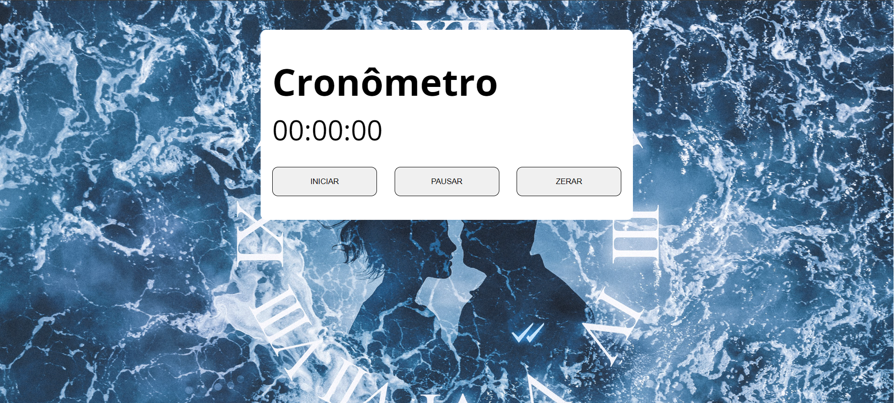

# Cronômetro JS

# ✍️ Projeto

Uma atividade desenvolvida com intuito de aprimorar meu conhecimento em javascript. Utilizei nesse projeto somente recursos front-end para verificar os estados de cada botão, após selecionado atribuir a característica da funcionalidade desejada. 

<strong>
Iniciar - Deve começar a atribuir o tempo no cronômetro 
Pausar - Deve parar a contagem do crônometro 
Zerar - Deve parar a contagem do cronômetro e atribuir o valor do estado inicial 
</strong>

 

# 🛠️Tecnologias utilizadas
  - <h2>HTML</h2>
  - <h2>CSS</h2>
  - <h2>Javascript</h2>
 

# 🖼️ Formulário de Validação

